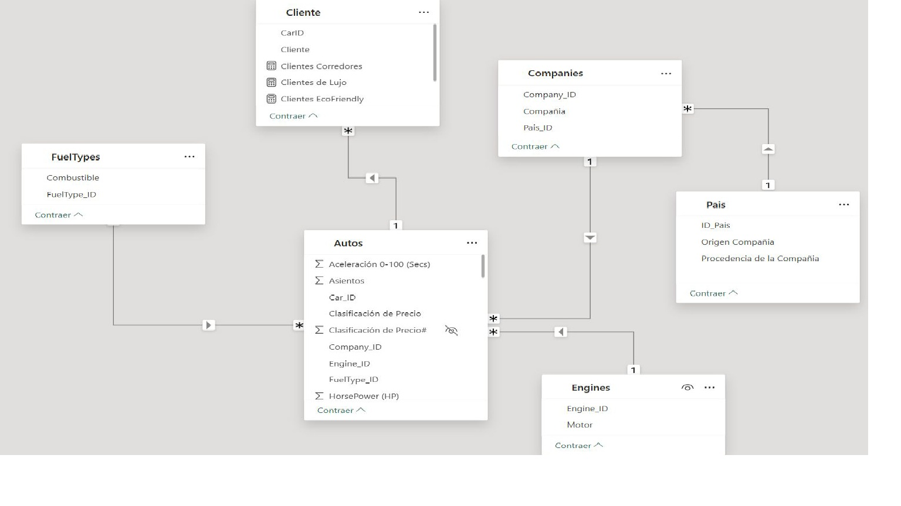
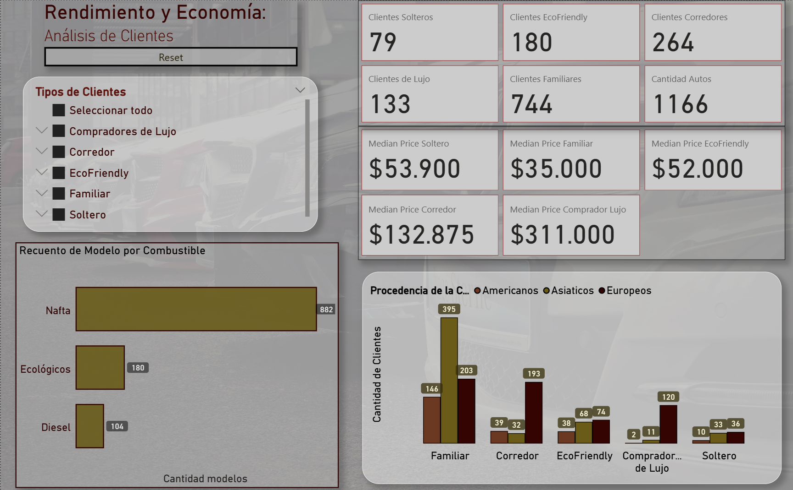
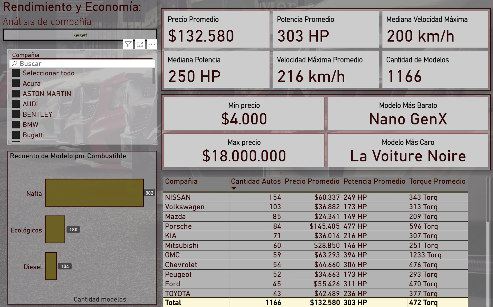
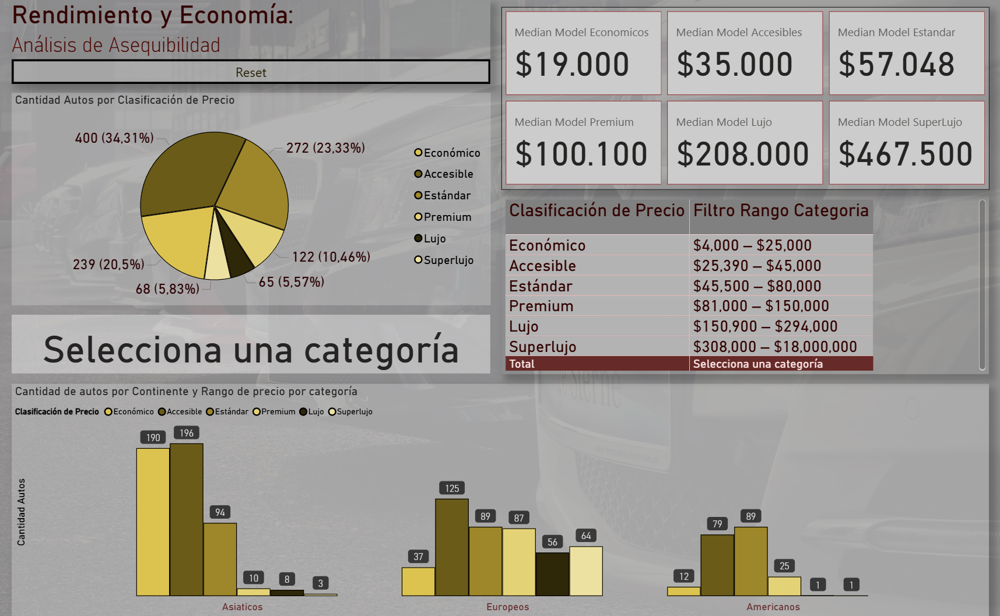
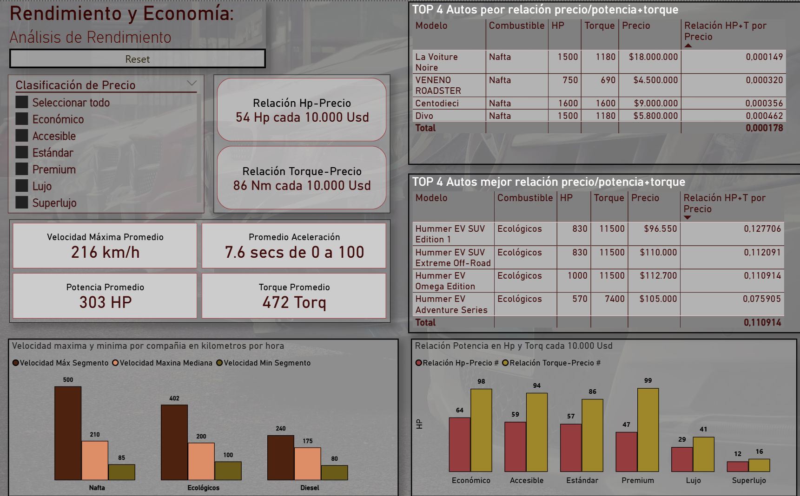

# Rendimiento y Economía: Estudio de Modelos Automotores

## Estructura del Repositorio

[Dataset original en Excel](./Cars.xlsx) 
[Archivo Power BI](./Cars.pbix)

---

## Definición del enfoque

Este proyecto analiza un conjunto de datos del mercado automotor para identificar patrones entre compañías, modelos y perfiles de clientes.  
El objetivo es ayudar a una nueva empresa que busca ingresar al mercado como revendedora a detectar qué marcas y modelos se ajustan mejor a cada tipo de usuario.  
Para ello, se realizó un proceso de limpieza, análisis y visualización de datos, generando indicadores clave y conclusiones sobre las preferencias del mercado.

---

## Características a implementar

### Perfiles de Usuario  
- Familiar  
- Soltero  
- Eco Friendly  
- Corredores  
- Compradores de lujo

### Gamas de modelos  
- **Económico** (USD 4 000 – 25 000)  
- **Accesible** (USD 25 390 – 45 000)  
- **Estándar** (USD 45 500 – 80 000)  
- **Premium** (USD 81 000 – 150 000)  
- **Lujo** (USD 150 900 – 294 000)  
- **Superlujo** (USD 308 000 – 18 000 000)

---

## 🗂 Descripción del Dataset

- **Fuente de datos:** Kaggle y Wikipedia  
- **Contenido:**  
  - Información sobre marcas y modelos  
  - Características técnicas  
  - Precios de venta  
- **Objetivo:** Analizar patrones de popularidad y precio, y facilitar la elección según perfil de usuario.
---

## Proceso de recopilación y limpieza de datos

1. **Recopilación**  
   - Dataset original: 1 tabla con 11 columnas → normalizado en 5 tablas.  
2. **Limpieza (SQL Server + Excel)**  
   - Null → 0.
   - Rangos de precio: promedio y extracción de valores numéricos.
   - Suma de asientos (“2+3” → 5).
   - Eliminación de duplicados.
   - Remoción de columna _battery capacity_.
   - Conversión de IDs a texto.
   - Exportación final a CSV y merge en XLSX.
   - Asignación de 6 categorías de precio.
   - Tabla de potenciales clientes vinculada a modelos.

---

## Diagrama del modelo de datos

---

## Transformaciones en Power Query

### Tabla: Autos

- Se importó la hoja "Autos" desde un archivo Excel.
- Se promovieron encabezados y se ajustaron tipos de datos (`CarID`, `Company_ID`, `EngineID`, `FuelTypeID`, etc.).
- Se eliminó la columna `"BatteryCapacity in CC"` por falta de relevancia.
- Se renombraron columnas para mejorar legibilidad (`CarName` → `Modelo`, `CarID` → `Car_ID`, `FuelTypeID` → `FuelType_ID`, `EngineID` → `Engine_ID`).
- Se convirtieron varios campos a texto para facilitar relaciones (`Car_ID`, `Company_ID`, `Engine_ID`).
- Se agregó la columna `"Puertas"` en base a la cantidad de asientos.
- Se creó la columna `"Gama de vehículo"` según el precio del auto, clasificando en: Económico, Accesible, Estándar, Premium, Lujo y Superlujo.
- Se renombró `"Personalizado"` como `"Clasificación de Precio#"` y se ajustaron tipos de datos ordenando la columna categorica por la numerica.

---

### Tabla: FuelTypes

- Se importó la hoja "FuelTypes" desde Excel.
- Se promovieron encabezados y se ajustaron tipos de datos.
- Se renombraron columnas (`FuelTypeID` → `FuelType_ID`, `FuelType` → `Combustible`).
- Se reemplazaron valores para mejorar la categorización:
  - `"Hybrid"` → `"Ecológicos"`
  - `"Gasoline"` → `"Nafta"`
- Se filtraron los tipos de combustible relevantes (`FuelType_ID` = 1, 2, 3).

---

### Tabla: Engines

- Se importó la hoja "Engines" desde Excel.
- Se promovieron encabezados y se ajustaron tipos de datos.
- Se renombraron columnas (`EngineID` → `Engine_ID`, `Engine` → `Motor`).

---

### Tabla: Companies

- Se importó la hoja "Companies" desde Excel.
- Se promovieron encabezados y se ajustaron tipos de datos.
- Se renombraron columnas (`Companies` → `Compañía`, `ID_Pais` → `Pais_ID`).

---

### Tabla: País

- Se reemplazaron valores en la columna `"Origen Geográfico"` para estandarizar:
  - `"Asis"` → `"Asiáticos"`
  - `"Europa"` → `"Europeos"`
  - `"America"` → `"Americanos"`
- Se renombraron columnas para mayor claridad:
  - `"Origen Geográfico"` → `"Procedencia de la Compañía"`
  - `"Pais Origen"` → `"Origen Compañía"`

---

### Tabla: Clientes (segmentación por perfil)

Se creó una tabla personalizada que clasifica a los usuarios según el tipo de auto que eligen:

| Usuario               | Criterios de Segmentación                                                                 |
|-----------------------|-------------------------------------------------------------------------------------------|
| EcoFriendly         | Autos con `FuelType_ID = 3` (Ecológicos)                                                 |
| Corredor            | `HorsePower ≥ 200` y `Aceleración 0-100 ≤ 5 seg`                                         |
| Familiar          | `Asientos ≥ 5`, `Puertas ≥ 4`, `Precio ≤ 70,000 USD`                                     |
| Soltero             | `HorsePower ≥ 80`, `Puertas ≤ 3`, `Precio ≤ 149,999 USD`                                 |
| Compradores de Lujo | `Clasificación de Precio = Lujo` o `Superlujo`                                           |

---

## Análisis por tipo de cliente

### 1. ¿Cuáles, cuántos y con qué precio mediano son los modelos más adecuados por perfil?  
- Segmentos ordenados por volumen:  
  1. Familias  
  2. Corredores  
  3. Eco-friendly  
  4. Lujo  
  5. Solteros  
- Conclusión:  
  - Familias → mayor volumen  
  - Lujo y corredores → precio medio muy superior  
  - Eco-friendly y solteros → opciones intermedias

### 2. ¿Cómo se distribuye la procedencia geográfica de las marcas preferidas?  
- Familias y eco-friendly → Asia (Japón, Corea)  
- Lujo y corredores → Europa  
- Solteros → mezcla equilibrada  
- Implicación:  
  - Asiáticos: seguridad, accesibilidad  
  - Europeos: aspiracionales y performance.

---

## Mercado global por perfil

### ¿A qué perfil está orientado el mercado automotor mundial?  
- Familias: mayor volumen → versatilidad y costo medio  
- Corredores y eco-friendly: secundario  
- Lujo y solteros: nichos reducidos  
- Recomendación: enfocarse en gamas de precio y modelos que satisfagan al perfil familiar para maximizar alcance.

---

## Análisis por precio y compañía

### 1. ¿Qué compañía es la más popular (mayor número de modelos)?  
- **Nissan:** 154 modelos (USD 60 337)  
- Volkswagen: 103 (USD 36 882)  
- Mazda: 85 (USD 24 341)  
- Porsche: 84 (USD 145 405)  
- KIA: 71 (USD 36 014)  
- Estrategia: rotación con Nissan + VW/Mazda + selecto de Porsche.

### 2. ¿Cuál es el modelo más económico y el más caro?  
- **Más económico:** Tata Nano GenX (Tata Motors)  
- **Más caro:** La Voiture Noire (Bugatti) – USD 18 000 000  
- Outliers notables: segundo más caro ~USD 9 000 000.

---

## Distribución por categoría de precio y origen

### 1. ¿Dónde se concentran los modelos según precio y región?  
- Económico/Accesible/Estándar → Asia (Corea, India, Japón)  
- Premium/Lujo/Superlujo → Europa  
- América: papel secundario, especialmente en tramos altos  
- Recomendación: priorizar stock asiático y mixto, reservar europeo para nichos. :contentReference[oaicite:13]{index=13}

### 2. Medianas de precio por categoría  
- 20 % Económico, 34 % Accesible, 23 % Estándar → medianas USD 19 000–57 048  
- 22 % Premium/Lujo/Superlujo → medianas USD 100 100–467 500  
- Enfoque en gamas medio-bajas para volumen.

---

## Análisis de rendimiento

### 1. Relación precio/(HP + Torque)  
- Eléctricos “mainstream” (Hummer EV) → mejor eficiencia  
- Coches de lujo (Bugatti, Lamborghini) → peor ratio  
- Conclusión: eléctricos ofrecen mayor potencia por dólar.

### 2. HP por USD 10 000 invertidos  
- Óptimo en modelos económicos; decrece al subir de categoría.

### 3. Mediana de velocidad por tipo de combustible  
- Gasolina y eléctricos → punta más alta  
- Diésel → rezagados  
- Recomendación: gasolina/eléctricos para velocidad.

---

## Conclusión General

El oferta mercado automotor global está segmentado por perfil de consumidor, con **familias** dominando volumen y optando por vehículos **asiáticos** accesibles.  
Los segmentos de **lujo** y **corredores** aportan mayor valor económico, apostando por **marcas europeas** de alta gama.  
El **78 %** del mercado se concentra en gamas **económicas–estándar**, reforzando un enfoque de **volumen**.  
Técnicamente, los **vehículos eléctricos** y **económicos** ofrecen la mejor **relación rendimiento/precio**, mientras que el segmento de **lujo** muestra rendimientos decrecientes por dólar.