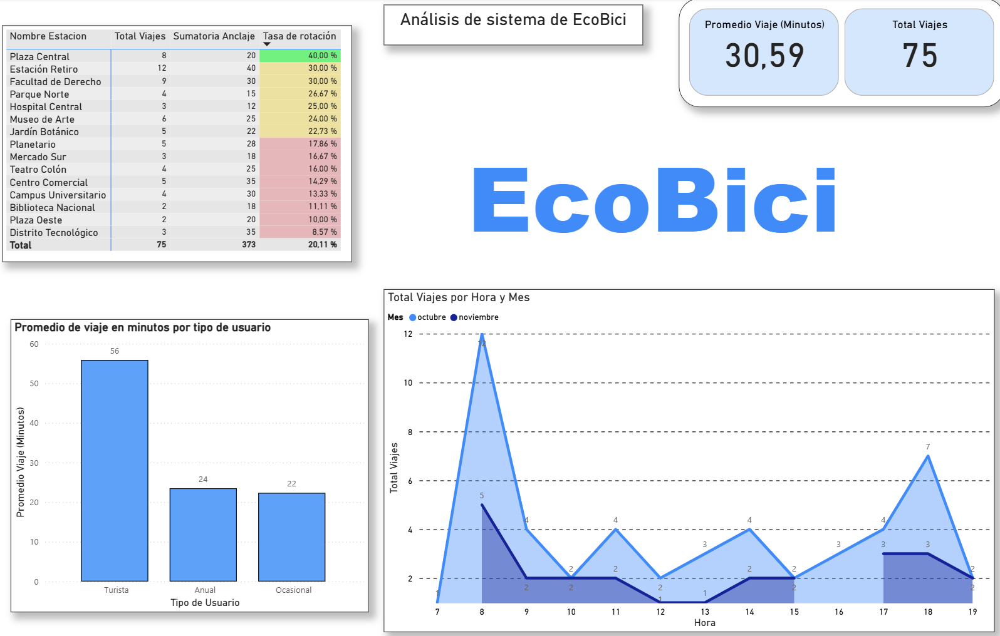

# 🚲 Análisis del Sistema EcoBici

Este proyecto analiza el uso del sistema de bicicletas públicas EcoBici en Buenos Aires, explorando patrones de viaje, rotación de estaciones y comportamiento de usuarios.

---
## 🧮 Transformaciones en Power Query

### 🔄 Tabla: Viajes

- Se cambiaron los tipos de datos para columnas clave (`ID_Viaje`, `ID_Usuario`, `Estacion_Origen`, `Estacion_Destino`, `Fecha de Inicio`, `Fecha fin`).
- Se convirtieron los IDs y estaciones a texto para facilitar relaciones con otras tablas.
- Se filtraron filas nulas en `ID_Viaje`.
- Se agregó una columna `"Hora"` extrayendo la hora desde `Fecha de Inicio`.
- Se duplicó la columna `"Hora"` y se renombró como `"Hora#"` para pruebas de formato.
- Se convirtió `"Hora"` a tipo texto para visualización en gráficos.

---

### 👥 Tabla: Usuarios

- Se promovieron encabezados desde la fuente.
- Se ajustaron tipos de datos (`ID_Usuario`, `Tipo de Usuario`, `Año de nacimiento`).
- Se renombró la columna `"a–o de nacimiento"` a `"Año de nacimiento"` para mejorar legibilidad.
- Se convirtió `ID_Usuario` a texto para compatibilidad con otras tablas.

---

### 📍 Tabla: Estaciones

- Se extrajo la tabla desde el archivo fuente (`Table_1`).
- Se ajustaron tipos de datos (`ID_Estacion`, `Nombre Estacion`, `Comuna`, `Capacidad Anclajes`).
- Se convirtió `ID_Estacion` a texto para facilitar relaciones con la tabla de viajes.

---

## 📋 Análisis Estratégico

### 1. ¿Cuáles son las 3 estaciones menos eficientes?

- 📍 Biblioteca Nacional  
- 📍 Plaza Oeste  
- 📍 Distrito Tecnológico  

Estas estaciones presentan las tasas de rotación más bajas del sistema, lo que indica un uso subóptimo.

---

### 2. ¿Qué acción propondrías para ellas?

🔧 Reducir el tamaño de las estaciones y reubicar los anclajes sobrantes hacia zonas de mayor demanda.

---

### 3. ¿Por qué?

Una baja rotación implica que las bicicletas permanecen estacionadas por largos períodos, lo que acelera su deterioro y representa una inversión inmovilizada. Redimensionar estas estaciones permite optimizar recursos y mejorar la eficiencia operativa.

---

### 4. ¿Qué tipo de usuario realiza los viajes más largos?

🧳 Los turistas, con un promedio de 56 minutos por viaje.

---

### 5. ¿Qué hipótesis podés formular a partir de este dato?

Los turistas probablemente utilizan el sistema para paseos recreativos o turísticos, mientras que los usuarios anuales lo emplean como medio de transporte cotidiano, especialmente para ir al trabajo.

---

### 6. ¿Cuáles son las 2 horas pico del sistema?

⏰ 8:00 AM y 18:00 PM  
Coinciden con los horarios típicos de entrada y salida laboral.

---

### 7. ¿Cómo podría el equipo de logística usar esta información?

El equipo puede anticipar la demanda en esas franjas horarias y planificar la redistribución de bicicletas con mayor precisión.  
📦 Por ejemplo:
- Asegurar disponibilidad en estaciones clave antes de las 8:00 AM.
- Reforzar capacidad de anclaje en zonas de retorno entre 17:30 y 18:30.

---

## 📊 Resumen del Dashboard

### 🔝 Estaciones con Mayor Rotación

| Nombre Estación         | Total Viajes | Sumatoria Anclaje | Tasa de Rotación |
|-------------------------|--------------|-------------------|------------------|
| 🟢 Plaza Central        | 20           | 8                 | 40.0%            |
| 🟡 Estación Retiro      | 12           | 4                 | 30.0%            |
| 🟠 Facultad de Derecho  | 10           | 3                 | 26.3%            |
| 🟠 Parque Norte         | 9            | 3                 | 24.0%            |
| 🔴 Hospital Central     | 9            | 3                 | 24.0%            |
| 🔴 Museo de Arte        | 6            | 2                 | 26.1%            |
| 🔴 Jardín Botánico      | 5            | 2                 | 23.1%            |
| 🔴 Planetario           | 5            | 2                 | 21.7%            |
| 🔴 Mercado Sur          | 7            | 3                 | 18.4%            |
| 🔴 Centro Comercial     | 5            | 2                 | 16.7%            |
| 🔴 Punto Universitario  | 2            | 1                 | 8.0%             |
| 🔴 Biblioteca Nacional  | 4            | 2                 | 14.3%            |
| 🔴 Plaza Oeste          | 3            | 1                 | 8.6%             |
| 🔴 Distrito Tecnológico | 8            | 3                 | 10.5%            |

**🔹 Totales:** 75 viajes | 36 anclajes | Rotación promedio: 20.1%

---

### 📈 Métricas Generales

- **Promedio de viaje (minutos):** `30.59`
- **Total de viajes:** `75`

---

### 📉 Promedio de viaje por tipo de usuario

| Tipo de Usuario | Promedio (min) |
|-----------------|----------------|
| 🧳 Turista       | 56             |
| 🗓️ Anual         | 24             |
| 🕐 Ocasional     | 22             |

---

### ⏰ Total de viajes por hora y mes

| Hora | Octubre | Noviembre |
|------|---------|-----------|
| 8    | 12      | 6         |
| 9    | 10      | 6         |
| 10   | 8       | 5         |
| 11   | 6       | 5         |
| 12   | 9       | 4         |
| 13   | 5       | 3         |
| 14   | 4       | 3         |
| 15   | 6       | 4         |
| 16   | 8       | 5         |
| 17   | 5       | 4         |
| 18   | 2       | 2         |

---

## 🧠 Lecciones Aprendidas

- La rotación de estaciones no siempre se correlaciona con la cantidad de viajes.
- Los turistas realizan viajes más largos, pero menos frecuentes.
- El horario pico varía entre meses, lo que puede indicar cambios estacionales o de comportamiento.

---

## 🛠️ Tecnologías Utilizadas

- **Power BI** para visualización
- **Excel / CSV / Power Query** para limpieza de datos

---