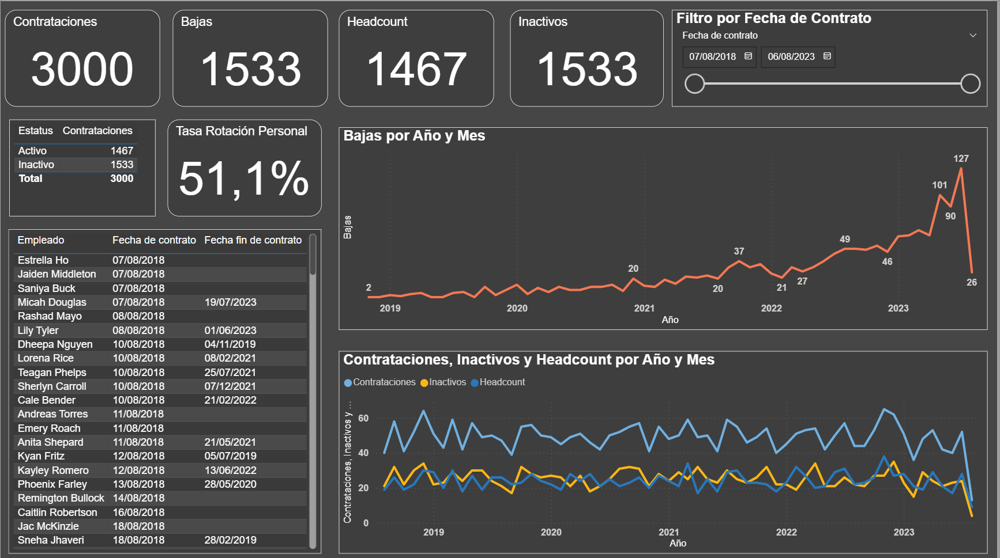

### 📘 Análisis Estratégico de Capital Humano

Este análisis brinda a la dirección una visión integral del ciclo de vida del empleado, permitiendo identificar riesgos, oportunidades y tomar decisiones informadas en torno a la gestión del talento.

---

### 🧱 Estructura del modelo

El modelo de datos está compuesto por cinco tablas principales que se relacionan entre sí:  

- **Empleados**: dimensiones de persona (`EmployeeID`), puesto, departamento, antigüedad, estatus.  
- **Encuesta**: resultados de compromiso, satisfacción, ambiente y su interpretación.  
- **Capacitación**: registro de programas, costo, duración y resultados de formación.  
- **Reclutamiento**: seguimiento de postulantes, fechas de aplicación y perfil.  
- **Calendario**: fecha para cruzar todos los hechos (encuestas, aplicaciones, capacitaciones).

---

### 1. 👥 Visión General de la Fuerza Laboral  
  
- **Headcount activo**: 1 467 empleados.  
- **Contrataciones totales** (jul 2018–jun 2023): 3 000.  
- **Bajas**: 1 533 → **Tasa de rotación histórica**: 51,1%.  
- **Satisfacción promedio**: 3,0/5 · **Ambiente laboral**: 3,0/5 · **Compromiso**: 2,9/5  
- **Interpretación de encuesta**:  
  - Oportunidad de mejora: 42,4%  
  - Requiere atención: 42,4%  
  - No requiere atención: 15,2%

---

#### 2. 📈 Evaluación de Desempeño  
  
- **Calificación promedio (headcount)**: 2,96/5  
- **Por departamento**  
  - Admin Offices: 3,13 · Production: 2,97 · Sales: 2,95  
  - IT/IS: 2,95 · Software Eng: 2,76 · Executive Office: 2,60  
- **Promedio por división**  
  - Billable Consultants: 3,4 · Project Management: 3,3  
  - Sales & Marketing: 3,3 · Executive: 3,2 · People Services: 3,2  
- **Calificación por cargo** (top/bottom según headcount)  
- **Tendencia vs. rotación**: línea histórica de calificación frente a rotación anual  

🔎 **Objetivo**: detectar unidades con desempeño débil y correlacionarlo con rotación y clima.

---

### 3. 📚 Capacitación  
  
- **Participación**: 1 467 trabajadores.  
- **Finalización**: 379 (25,8%) · **No finalizaron**: 1 088 (74,2%).  
- **Inversión total**: \$ 1 675 886 · **Costo fallido**: \$ 1 260 110 (75,2%).  
- **Compromiso promedio**: 2,9/5 · **Satisfacción**: 3,0/5 · **Ambiente**: 3,0/5

---

### 4. 🌟 Compromiso y Clima Laboral  
  
- **Compromiso promedio**: 2,9/5  
- **Satisfacción promedio**: 3,0/5  
- **Ambiente laboral**: 3,0/5  
- **Interpretación**:  
  - Oportunidad de mejora: 42,4%  
  - Requiere atención: 42,4%  
  - No requiere atención: 15,2%

---

### 5. 🔄 Retención y Rotación  
  
- **Tasa de rotación**: 51,1%  
- **Por antigüedad**:  
  - ≤ 2 años: 95,6%  
  - 3–5 años: 28,4%  
- **Por departamento**:  
  - Admin Offices: 60,0% · Executive Office: 79,2%  
  - IT/IS: 52,1% · Production: 50,2%  
  - Sales: 49,6% · Software Eng: 55,7%  
- **Por cargo**:  
  - Data Architect: 100% · Enterprise Architect: 80%  
  - Software Eng Manager: 70% · Senior BI Dev: 66,7% · BI Dev: 65,9%  
- **Tipo de baja**: Involuntarias 25,3% · Renuncias 24,8% · Retiros 24,6% · Voluntarias 25,3%

---

### 🧮 Transformaciones y Limpieza en Power Query

### 1. 👥 Tabla Empleados
- Unificación de `Nombre` + `Apellido` → `Empleado`.  
- Renombrado de campos (`Title` → `Puesto`, `ADEmail` → `Email`, etc.).  
- Conversión de fechas (`StartDate`, `ExitDate`, `DOB`).  
- Cálculo de `Edad`, `Antigüedad` y `Estatus` (`Activo`/`Inactivo`).  
- Creación de `Interpretación de resultado` (Atención / Oportunidad / Satisfecho).

---

### 2. 📊 Tabla Encuesta de Compromiso
- `Engagement Score` → `Compromiso`.  
- `Resultado` = promedio(`Compromiso`,`Satisfaction`,`WorkEnv`).  
- Segmentación de `Resultado` en categorías.

---

### 3. 📋 Tabla Reclutamiento
- Concatena nombre + apellido en `Postulante`.  
- Renombrado y normalización de `Género`, `Email`, `Años de experiencia`.  
- Limpieza de `Teléfono` y otros formatos.

---

### 4. 🎓 Tabla Capacitación
- Renombra `Program` → `Programa`; `Status` → `Resultado`; `Duration` → `Duración`.  
- Conversión de duración y costo a numérico.  
- Ajuste regional de separadores decimales.

---

### 📊 Resultado del Análisis de Recursos Humanos

### 🧾 Conclusión General
La empresa presenta una **alta fuga de talentos**, con una **tasa de rotación histórica del 51,1%** (1 de cada 2 empleados):

- Erosiona la **continuidad operativa**, la **rentabilidad**, la **especialización** y la **calidad** de entregables.

---

### 5 🔍 Principales causas de la alta rotación

1. **Calificación laboral deficiente**  
   - Promedio **2,96/5**, por debajo del umbral recomendado (≥ 3).  
2. **Compromiso laboral bajo**  
   - **2,9/5**, impacta productividad y retención.  
3. **Ambiente laboral regular**  
   - **3,0/5**, no genera un entorno motivador.  
4. **Satisfacción insuficiente**  
   - **3,0/5**, vínculo directo con la intención de abandono.  
5. **Problemas en la capacitación**  
   - **74,2%** no finaliza los programas → **75,2%** del presupuesto fallido (\$ 1 260 110).

---

### 📌 Recomendaciones sugeridas
- Revisar y modernizar contenidos y formatos de capacitación.  
- Diseñar planes de acción para elevar compromiso y satisfacción.  
- Mejorar iniciativas de clima laboral y reconocimiento.  
- Implantar métricas de seguimiento y mejora continua.

---

## 🎯 Impacto en el Negocio

La combinación de alta rotación y valoración media del talento:  
- ⏳ Compromete la continuidad de proyectos  
- 📉 Reduce márgenes y eleva costos de reemplazo  
- 🔄 Limita la agilidad ante cambios del mercado  
- 🧠 Provoca pérdida de conocimiento crítico