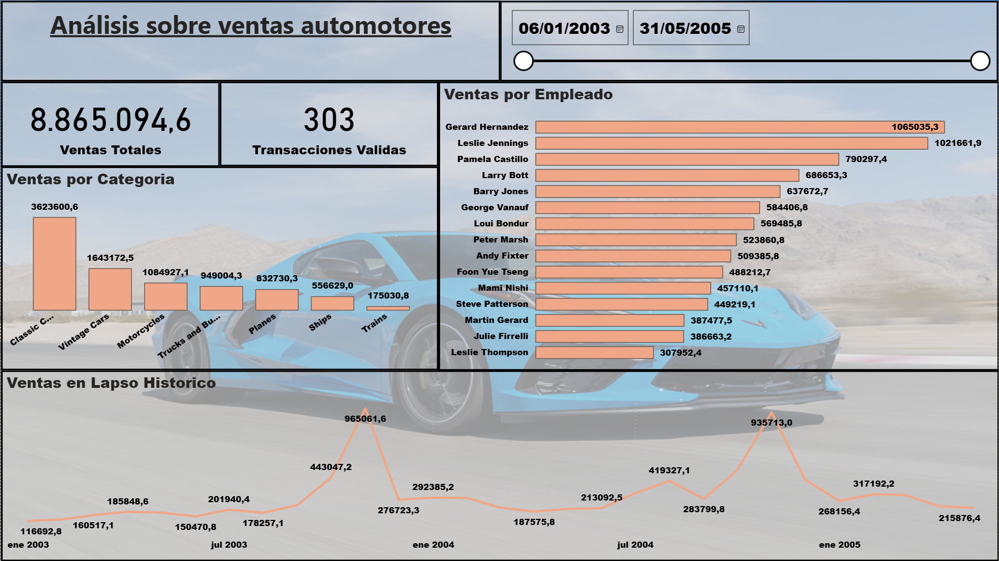

# Proyecto BI: Análisis de Ventas Automotores – ClassicModels Ltda.

## 1. Contexto y Alcance  
Caso ficticio: ClassicModels Ltda. desea instaurar una cultura de datos para tomar decisiones objetivas y mejorar la atención al cliente. Para ello, se ha contratado el desarrollo de un informe de Business Intelligence en Power BI que responda a las siguientes preguntas de negocio:

1. ¿Cuántas transacciones válidas se han realizado de forma histórica?  
2. ¿Cuál es el monto total de las ventas históricas?  
3. ¿Cuál es el monto de las ventas por categoría de productos?  
4. ¿Cómo se distribuye el monto de ventas a lo largo del tiempo?  
5. ¿Cuál es el monto de ventas por vendedor?  

En este repositorio encontrarás:

- **Conexión y modelado** de datos en Power Query  
- **Cálculos DAX** para métricas clave  
- **Visualizaciones**: tarjetas, columnas, barras, líneas y segmentador de fechas  
- **Análisis de resultados** y **recomendaciones**  

---

## Dashboard

 
## Resumen de KPIs Clave

1. **Transacciones válidas (Shipped)**  
   - **303** transacciones  

2. **Ventas totales históricas**  
   - **8.865.094,6**  

3. **Ventas por categoría**  
   | Categoría          | Monto       |
   |--------------------|------------:|
   | Classic Cars       | 3.623.600,6 |
   | Vintage Cars       | 1.643.172,5 |
   | Motorcycles        | 1.084.927,1 |
   | Trucks and Buses   |   949.004,3 |
   | Planes             |   832.730,3 |
   | Ships              |   556.629,0 |
   | Trains             |   175.030,8 |

4. **Distribución de ventas en el tiempo**  
   - **Pico máximo**: ene-2004 → 965.061,6  
   - **Segundo pico**: ene-2005 → 935.713,0  
   - **Valor mínimo**: jul-2003 → 150.470,8  
   - Tendencia general: sube hacia enero de cada año y cae en el período mar-may.

- Las ventas crecieron un 18% interanual.
- La región norte mostró mayor rentabilidad por unidad vendida.
- El 80% de las ventas provienen del 20% de los productos (ley de Pareto).

## Archivos

- `ventas.pbix`: archivo de Power BI.
- `datos/`: carpeta con los CSV originales.
- `README.md`: documentación del proyecto.
